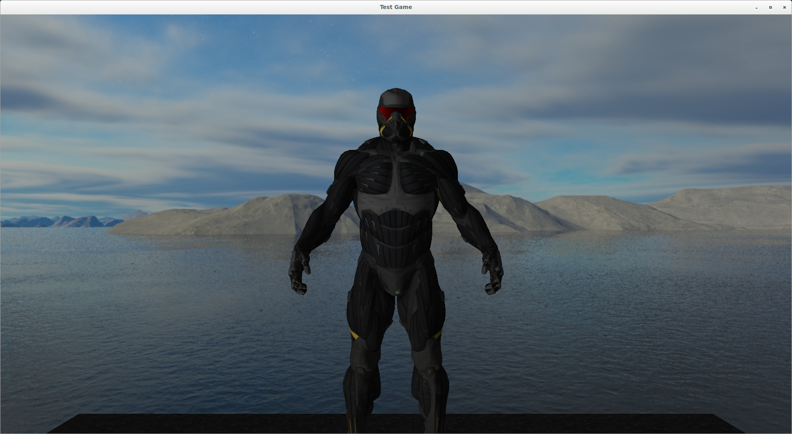

# game_engine
This is a mostly self-contained 3D game engine written in C++. This game engine has been tested on Ubuntu 18.04.

### Requirements/Dependencies
- C++14 compiler
- CMake

### Installation
1. git clone https://github.com/kyungminkim7/game_engine.git
2. cd game_engine
3. cmake -H. -Bbuild
4. cd build
5. make -j8

### Running the example game
(Inside the build directory)
1. cd apps/example_game
2. ./example_game
